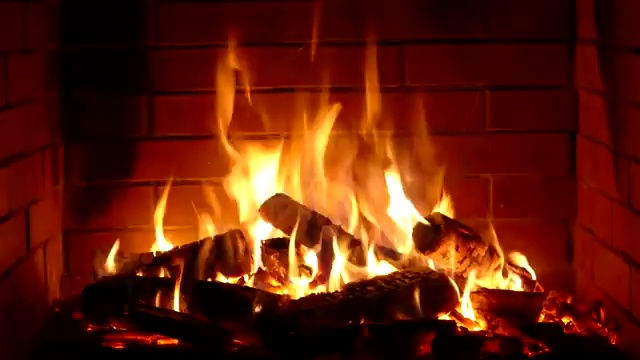

# led-fire-place
Python scripts used to generate LED intensity data sequences to mimic fireplace video.

Video of LED fireplace:
https://youtu.be/rBeaxTevjns

Used these scripts to generate data for an LED display that mimics an indoor fire.

## Steps

### 1. Build LED display

I used just under 90 RGB WS2812 LEDS connected to a [Teensy microcontroller](https://www.pjrc.com/teensy/) running the [FastLED library](https://fastled.io).

### 2. Switch each LED on separately in a sequence and film it with a smartphone video camera

### 3. Load video file and select a frame to represent the effect of each LED

See this Jupyter notebook:
- [Analyse-images-from-LED-display-video-capture.ipynb](Analyse-images-from-LED-display-video-capture.ipynb)

Frame from phone camera video:

</img>

### 4. Download a video from YouTube of a real fire in a fireplace and extract image frames

See this Jupyter notebook:
- [Prepare-data-from-YouTube-video.ipynb](Prepare-data-from-YouTube-video.ipynb)

Frame from [YouTube video](https://www.youtube.com/watch?v=L_LUpnjgPso):

</img>

### 5. Compute LED intensities to mimic the real fire video

This involves mimicing the LED display using the image masks for each LED and finding a set of LED intensities (RGB) that best reproduce the image.

See this Jupyter notebook:
- [Load-Fire-Video-and-Compute-display-LED-intensities.ipynb](Load-Fire-Video-and-Compute-display-LED-intensities.ipynb)

