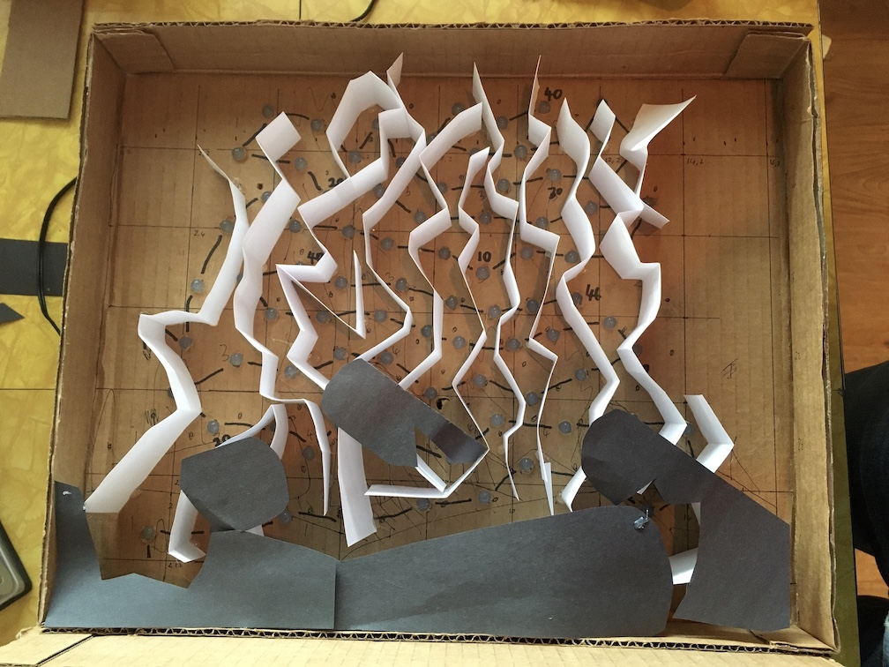
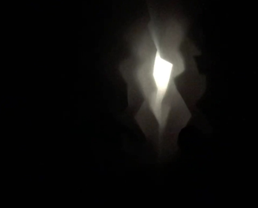
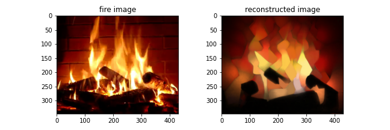

# led-fire-place
Python scripts used to generate LED intensity data sequences to mimic fireplace video.

Click image below to see YouTube video of the LED fireplace:

See also this instructables articles I wrote:
 - [Electronic LED Fireplace](https://www.instructables.com/Electronic-LED-Fireplace/)

## Steps

### 1. Build LED display

I used just under 90 RGB WS2812 LEDS connected to a [Teensy microcontroller](https://www.pjrc.com/teensy/) running the [FastLED library](https://fastled.io).

To create a flame-like effect, I used strips of white paper glued to a carboard frame with the LEDs pushed through holes in a random pattern and black paper for the simulated logs.

</img>

### 2. Switch each LED on separately in a sequence and film it with a smartphone video camera

Here is the Arduino script for the Teensy:
 - [fire-test/fire-test.ino](fire-test/fire-test.ino)

### 3. Load video file and select a frame to represent the effect of each LED

See this Jupyter notebook:
- [Analyse-images-from-LED-display-video-capture.ipynb](Analyse-images-from-LED-display-video-capture.ipynb)

Frame from phone camera video:

</img>

### 4. Download a video from YouTube of a real fire in a fireplace and extract image frames

See this Jupyter notebook:
- [Prepare-data-from-YouTube-video.ipynb](Prepare-data-from-YouTube-video.ipynb)

I used this video on YouTube: [YouTube video](https://www.youtube.com/watch?v=L_LUpnjgPso):

### 5. Compute LED intensities to mimic the real fire video

This involves mimicking the LED display using the image masks for each LED and finding a set of LED intensities (RGB) that best reproduce the image.

See this Jupyter notebook:
- [Load-Fire-Video-and-Compute-display-LED-intensities.ipynb](Load-Fire-Video-and-Compute-display-LED-intensities.ipynb)

### 6. Adjust LED intensities and upload to microcontroller

See this Jupyter notebook:
- [Process-data-for-LED-display.ipynb](Process-data-for-LED-display.ipynb)

Here is the final Arduino script to run the LED sequence on the Teensy:
 - [fire/fire_data.h](fire/fire_data.h)
 - [fire/fire.ino](fire/fire.ino)

