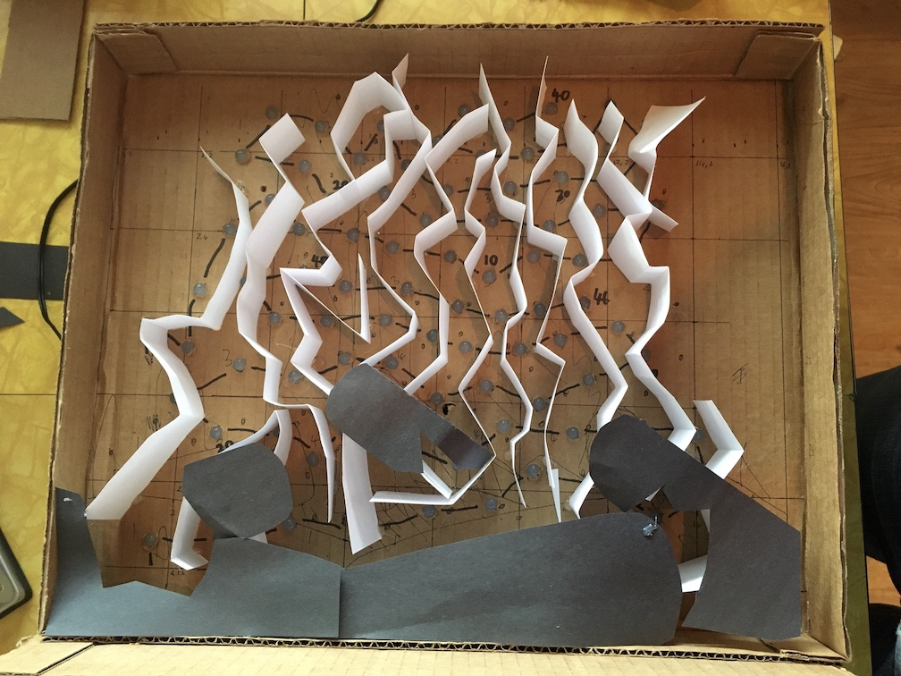
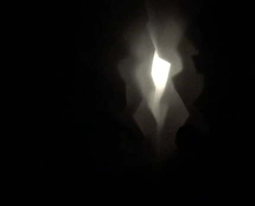
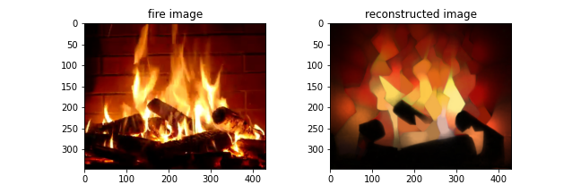

# led-fire-place
Python scripts used to generate LED intensity data sequences to mimic fireplace video.

Click image below to see YouTube video of the LED fireplace:

[](https://youtu.be/rBeaxTevjns "Video Title")

See also this instructables articles I wrote:
 - [Electronic LED Fireplace](https://www.instructables.com/Electronic-LED-Fireplace/)

## YouTube video sampling and LED frame generation

LED fireplace frame sequences for the
[display1593](https://github.com/billtubbs/display1593) 1593-LED display,
played back on a Raspberry Pi via `fireplace/play_fire_frames.py` in that
repo. The general-purpose code (downloading, cropping, loop search, LED
conversion) is in the sibling
[gen-video-frames](https://github.com/billtubbs/gen-video-frames) package;
this repo holds the fireplace's parameters and results.

### Current sequence

`clip_params.yaml` specifies the current 197.7s fireplace loop (see
Results below):

```
gen-video-frames download clip_params.yaml     # -> loop_clip.mp4
gen-video-frames find-loops clip_params.yaml   # -> loop_candidates.csv, loop_seams/
gen-video-frames generate clip_params.yaml     # -> fire_frames_crop120.npz
```

Copy the output to the Pi as `fireplace/data/fire_frames.npz` (it isn't
committed in either repo), e.g.:

```
rsync -av fire_frames_crop120.npz pi@pi.local:/home/pi/code/display1593/fireplace/data/fire_frames.npz
```

### Older scripts

These produced the original 30.5s clip (still committed in display1593 as
one CSV per frame, used when there's no `fire_frames.npz`):

- **`extract_frames.py`** - downloads and samples the 94.5s-125.0s range
  at 30fps, crops it, and saves the frames as JPEGs to
  `yt_frames_cropped/`.
- **`generate_led_frames.py`** - converts those JPEGs into one LED CSV per
  frame in `led_frames/`.
- **`analyse_video.py`** - the first loop-point search: RMSE between every
  pair of 64x64 greyscale thumbnails in a window of the video. Superseded
  by `gen-video-frames find-loops` (which compares the actual LED values,
  and only for the loop lengths wanted, so it handles long clips).

### Setup

Requires `ffmpeg` on the PATH and Python 3.10+.

```
python3 -m venv .venv
.venv/bin/pip install -e /path/to/gen-video-frames
.venv/bin/pip install -e /path/to/display1593 --no-deps
.venv/bin/pip install -e .
```

`display1593` is installed with `--no-deps` for its lightweight
`image_conversion` module, without its hardware-only dependencies - see
the gen-video-frames README.

### Results

["Cozy Fireplace 4K (12 hours)"](https://www.youtube.com/watch?v=g6Ye4xwXyAw)
**is a 211.4s loop repeated** (6342 frames at 30fps). `analyse_video.py`
didn't find it: its 60s window was shorter than the period, and the 300s
run at 2fps didn't pick it out. Running the loop search (now `gen-video-frames find-loops`) over the first
600s of the video, every top candidate was exactly 211.40s long. Frames
6342 apart differ by a median RMS of 6.4 on the 0-255 LED scale -
consistent with compression noise only - compared with 43.4 between
consecutive frames.

The uploader hid the join with a ~1s crossfade from the end of the loop
into its start at each repeat (frames 6342-6371, 12684-12713, ...). The
very start of the video (frames 0-29) shows the un-blended start instead,
so it doesn't match the repeats. The step across the join (frame 6341 to
6342) is an RMS LED difference of 37.1, less than a typical step between
consecutive frames (median 43.4, 10th-90th percentile 38-50); a hard cut
back to the un-blended start (6341 to 0) would be 68.1.

So `clip_params.yaml` downloads one period starting at the first join
(211.4s-422.8s, `loop_clip.mp4`). Played on repeat, its last-to-first
frame step (37.2) is the same as the video's own step into its next
repeat, i.e. it loops seamlessly.

A search for shorter loops (180-211.3s) within that one period found
nothing as good: the best seam scored an RMS of 52.1 (197.7s long),
above the 90th percentile of normal frame-to-frame changes, and the top
candidates all start inside the crossfade, where blended frames match a
little more easily.

The previous LED data (`extract_frames.py`) used a manually-chosen 30.5s
near-loop (94.5s-125.0s) of the same footage, with a small discontinuity
at the seam.

## Archived content

The following relates to an earlier, separate ~90-LED cardboard fireplace
build (a different physical display to the 1593-LED display1593 project
above) and its own now-superseded video-processing pipeline.

### 1. Build LED display

I used just under 90 RGB WS2812 LEDS connected to a [Teensy microcontroller](https://www.pjrc.com/teensy/) running the [FastLED library](https://fastled.io).

To create a flame-like effect, I used strips of white paper glued to a carboard frame with the LEDs pushed through holes in a random pattern and black paper for the simulated logs.

</img>

### 2. Switch each LED on separately in a sequence and film it with a smartphone video camera

Here is the Arduino script for the Teensy:
 - [fire-test/fire-test.ino](fire-test/fire-test.ino)

### 3. Load video file and select a frame to represent the effect of each LED

See this Jupyter notebook:
- [Analyse-images-from-LED-display-video-capture.ipynb](Analyse-images-from-LED-display-video-capture.ipynb)

Frame from phone camera video:

</img>

### 4. Download a video from YouTube of a real fire in a fireplace and extract image frames

See this Jupyter notebook (superseded by gen-video-frames / `extract_frames.py` above):
- [Prepare-data-from-YouTube-video.ipynb](Prepare-data-from-YouTube-video.ipynb)

I used this video on YouTube: [YouTube video](https://www.youtube.com/watch?v=L_LUpnjgPso):

### 5. Compute LED intensities to mimic the real fire video

This involves mimicking the LED display using the image masks for each LED and finding a set of LED intensities (RGB) that best reproduce the image.




See this Jupyter notebook (superseded by `generate_led_frames.py` above):
- [Load-Fire-Video-and-Compute-display-LED-intensities.ipynb](Load-Fire-Video-and-Compute-display-LED-intensities.ipynb)


### 6. Adjust LED intensities and upload to microcontroller

See this Jupyter notebook:
- [Process-data-for-LED-display.ipynb](Process-data-for-LED-display.ipynb)

Here is the final Arduino script to run the LED sequence on the Teensy:
 - [fire/fire_data.h](fire/fire_data.h)
 - [fire/fire.ino](fire/fire.ino)
